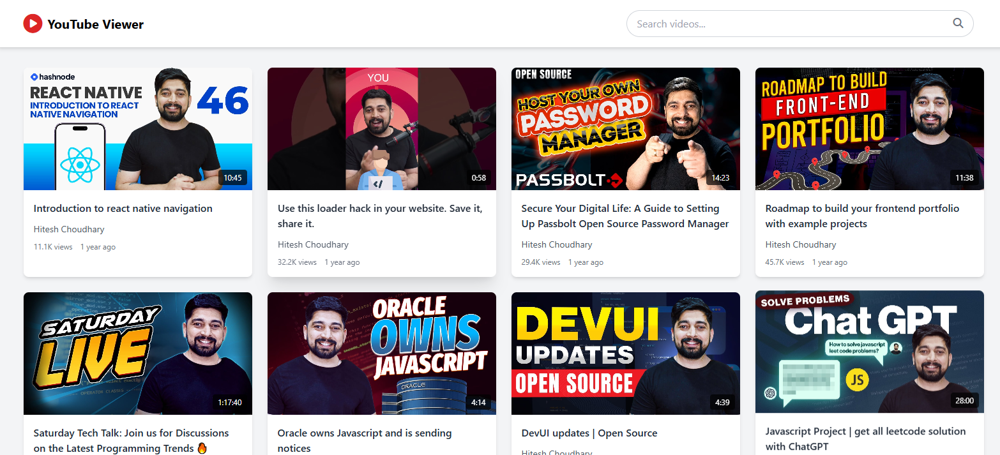

# YouTube Video Listing Page

A YouTube-style video listing page that fetches and displays videos from the FreeAPI YouTube endpoint.

### Features

- Fetch and display a list of YouTube videos
- Show video thumbnails, titles, and channel names
- Click on a video to open it in YouTube
- Add a search bar to filter videos (filteration is done on frontend without any additional api calls)
- Implement a grid layout for better UI

## Live UTL:
-  http://youtube-video-listing01.netlify.app/

